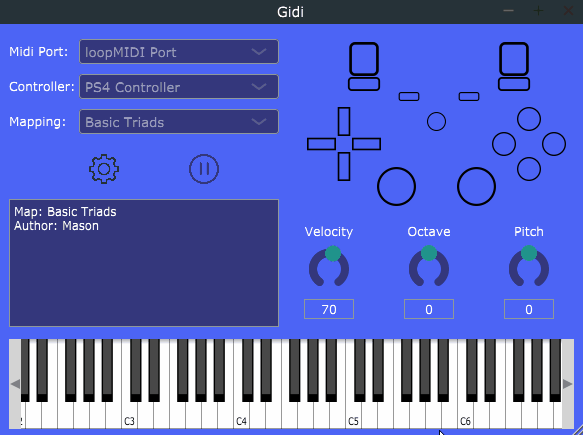

## Gidi
#### A new way to play

Gidi is a tool that turns your gamepad (any typical game controller) into a digital instrument.  By mapping button presses and stick gestures to MIDI output, you can use Gidi with any DAW and synth to make music with an interface you already have muscle memory using (the gamepad)!

## Available Platforms

32 bit and 64 bit builds can be used on the following platforms:

- Linux 
- Windows 
- MacOS

## Dependencies

- JUCE with Projucer
- SDL2 development libraries and runtime library
- nhlohhman/json library

## Building

First step on all platforms is open up the project file in the main directory with
Projucer. From here you can find the exporter for your preferred platform/IDE and
export it.  If you need to make your own exporter, make sure you are linking to the SDL2 library somewhere (i.e. -lSDL2 in linker flags).

If you have any issues for building on your platform, please let me know in the
Github issues or via e-mail at masondructor at gmail dot com.  I haven't had the 
opportunity to test the MacOS build.

## Contributions

Gidi is still in active development, although sporadic.  If you have 
interest in contributing in anyway, you are more than welcome. I'm open to
feature requests, bug reports, and any suggestion you might have.

---
Copyright 2017-2020 Mason Dructor

    This file is part of Gidi.

    Gidi is free software: you can redistribute it and/or modify
    it under the terms of the GNU General Public License as published by
    the Free Software Foundation, either version 3 of the License, or
    (at your option) any later version.

    Gidi is distributed in the hope that it will be useful,
    but WITHOUT ANY WARRANTY; without even the implied warranty of
    MERCHANTABILITY or FITNESS FOR A PARTICULAR PURPOSE.  See the
    GNU General Public License for more details.

    You should have received a copy of the GNU General Public License
    along with Gidi.  If not, see <https://www.gnu.org/licenses/>.